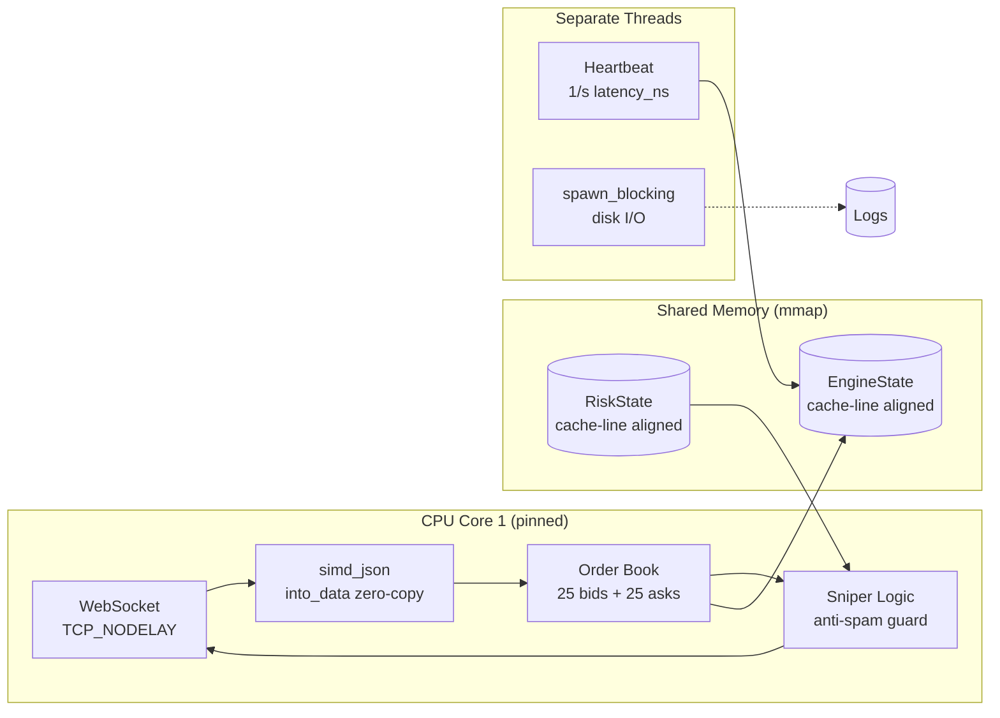

# 🐺 Beroun Sniper v5.2 — HFT Trading Bot

Vysokofrekvenční obchodní bot pro Bitfinex BTC/USD. Rust 2024, zero-copy architektura, sub-millisecond tick-to-trade.

## Architektura



## Adresářová struktura

```
/home/wwwenda/hft-sniper/
├── src/
│   ├── main.rs              # Core engine + WebSocket + Sniper logic
│   ├── types.rs              # EngineState, RiskState, OrderBookLevel (lib)
│   └── sovereign_ai.rs      # AI risk module (separate binary)
├── runtime/
│   ├── engine_state.bin      # mmap shared state (auto-generated)
│   └── risk_state.bin        # mmap risk params (auto-generated)
├── logs/
│   ├── beroun_trading.log    # Trading alerts
│   └── watchdog.log          # Watchdog logs
├── .env                      # BITFINEX_API_KEY, BITFINEX_API_SECRET
├── Cargo.toml
└── beroun-start.sh           # Manual launcher
```

## Operační příkazy

```bash
# Status
systemctl --user status beroun-sniper

# Live logy
journalctl --user -u beroun-sniper -f

# Restart
systemctl --user restart beroun-sniper

# Stop
systemctl --user stop beroun-sniper

# Sledování obchodů
journalctl --user -u beroun-sniper -f | jq 'select(.fields.event == "sniper_fire")'

# Sledování chyb z Bitfinexu
journalctl --user -u beroun-sniper -f | jq 'select(.fields.event == "bitfinex_notification")'
```

## Systemd služba

**Cesta:** `~/.config/systemd/user/beroun-sniper.service`

| Parametr | Hodnota |
|----------|---------|
| Type | simple |
| Restart | always (RestartSec=5) |
| Linger | yes (běží bez SSH session) |
| ExecStartPre | Čistí runtime/*.bin |
| Environment | RUST_LOG=info |

## Memory Layout (mmap IPC)

### EngineState — Cache-line izolovaný

```
Offset  Zone         Fields                          Access Pattern
──────  ──────────   ──────────────────────────────   ──────────────────
0x000   HEARTBEAT    latency_ns + 56B pad            Background task, 1/s
0x040   HOT          best_bid, best_ask              Main loop, 100s/s
0x050   HOT          bids[25] (25×24B = 600B)        Main loop (sort)
0x2C8   HOT          asks[25] (25×24B = 600B)        Main loop (sort)
0x540   PAD          64B cache line boundary          ─── isolation ───
0x580   COLD         net_position, realized_pnl       Infrequent writes
0x590   COLD         wallet_btc, wallet_usd           On "wu" message
0x5A0   COLD         checksum, last_buy/sell_price    On sniper_fire
```

### OrderBookLevel — Compact `repr(C)` (24 bytes)

```
Field    Type        Size   Offset
───────  ─────────   ────   ──────
price    AtomicU64   8B     0x00
amount   AtomicI64   8B     0x08    (positive=bid, negative=ask)
count    AtomicU64   8B     0x10
```

> [!IMPORTANT]
> Záměrně **bez** `align(64)` — 25 levelů = 600B = 10 cache lines.
> S align(64) by bylo 1600B = 25 cache lines → 2.5× horší spatial locality pro `sort_unstable_by`.

### RiskState — `paused` izolován

```
Offset  Field           Popis
──────  ─────────────   ──────────────────────────
0x000   paused + 56B    Vlastní cache line (čtena na každém tick)
0x040   grid_step       $3 default (scaled: 3×1e8)
0x048   grid_size       2
0x050   order_usd       $50 default (scaled: 50×1e8)
0x058   max_inv_delta   0.005 BTC
0x060   bias_offset     0 (signed, pro directional bias)
```

## Optimalizace na Hot Path

### Tick-to-Trade Pipeline

```
WebSocket msg → into_data().to_vec() → simd_json in-place → update_book
    → sort_unstable_by → checksum verify → sniper_fire (if Δ ≥ $1)
```

| Optimalizace | Detaily | Dopad |
|---|---|---|
| **simd_json** | SIMD-accelerated JSON parser, in-place mutation | ~10× vs serde_json |
| **into_data().to_vec()** | Consume Message directly, no double-buffer | Eliminuje 1 memcpy |
| **sort_unstable_by** | In-place pdqsort, no auxiliary allocation | ~50-200ns savings |
| **write_bfx** | Stack buffer [u8;32] pro checksum formatting | 0 heap alloc/level |
| **format! orders** | Direct string vs json! Value tree | ~5× faster |
| **TCP_NODELAY** | Disabled Nagle's 40ms buffering | Instant order send |
| **CPU pinning** | Core 1 dedicated, current_thread runtime | Zero cache migration |
| **spawn_blocking** | Disk I/O delegated to separate thread pool | Unblocks executor |
| **Anti-spam** | MIN_TICK $1 + 3s interval | ~85% fewer API calls |

### Co se nepoužívá a proč

| Rozhodnutí | Důvod |
|---|---|
| `align(64)` na OrderBookLevel | Zhoršuje spatial locality při řazení |
| `#[tokio::main]` | Multi-thread pool migruje tasky na nepřipnutá jádra |
| `json!` pro ordery | Alokuje Value strom → zbytečné na hot path |
| Blocking `OpenOptions` v async | Blokuje Tokio executor |

## Bezpečnostní opravy

| Problém | Řešení |
|---|---|
| UB: `&mut EngineState` aliasing | Raw `*mut EngineState` pointer |
| Float precision drift | `.round()` před `as u64/i64` |
| i64→u64 overflow | `i64` aritmetika s `.max(0)` |
| `safe_as_f64()` / `safe_as_i64()` | simd_json integer/float type barrier |

## Konfigurace

### `.env` (povinné)

```env
BITFINEX_API_KEY=...
BITFINEX_API_SECRET=...
TELEGRAM_BOT_TOKEN=...     # optional
TELEGRAM_CHAT_ID=...       # optional
```

### RiskState defaults (v `types.rs`)

| Parametr | Default | Popis |
|---|---|---|
| grid_step | $3 | Vzdálenost limitky od mid-price |
| grid_size | 2 | Počet párů objednávek |
| order_usd | $50 | Velikost objednávky v USD |
| max_inv_delta | 0.005 BTC | Max inventory delta |
| bias_offset | 0 | Directional bias (signed) |

## Git Historie

```
19b3037 perf(core): eliminate msg_buffer double-copy
61069a4 perf(core): TCP_NODELAY + proper false sharing layout
b08af26 perf(core): current_thread runtime + false sharing prevention
0f1c095 perf(core): zero-alloc checksum + CPU affinity pinning
5b047ee perf(core): hot-path optimizations — zero-alloc message loop
94c073a feat(core): Phase 1 trading fixes + systemd service
cebb9e3 feat(core): anti-spam + non-blocking I/O
793c751 fix(core): resolve order book sync — simd_json type barrier
```

## Známé Limitace

1. **Sell ordery** selhávají bez BTC balance na exchange walletce
2. **`into_data().to_vec()`** — tungstenite 0.26 vrací `Bytes` (immutable), true zero-copy by vyžadoval `fastwebsockets`
3. **`oc_multi all`** ruší všechny ordery před re-submit — ideálně rušit jen konkrétní order IDs
4. **Grid je statický** — dynamický `spread/2` grid_step by lépe sledoval trh
