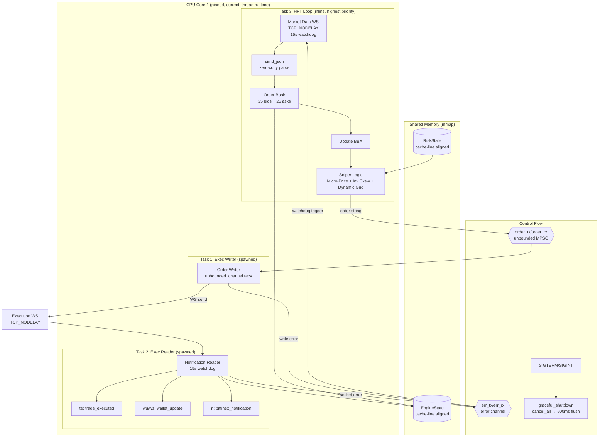

# 🐺 Beroun Sniper v5.4 — HFT Trading Bot

Vysokofrekvenční obchodní bot pro Bitfinex BTC/USD. Rust 2024, zero-copy architektura, sub-millisecond tick-to-trade.

## Architektura v5.4 — Dual WebSocket + Watchdog + Trading Intelligence



## Proč Dual WebSocket?

**Problém:** Jeden WS pro data i ordery → **TCP Head-of-Line blocking**.
Při markentím volume přijímáš stovky book updatů, a tvůj order čeká ve frontě na TCP ACK.

**Řešení:**
| WS | Účel | Auth | Subscribe |
|----|-------|------|-----------|
| Market Data | Příjem order booku | ❌ Ne | ✅ book tBTCUSD |
| Execution | Ordery + notifikace | ✅ Ano | ❌ Ne |

Order string se formátuje na hot path a posílá přes `unbounded_channel` — **nanosekunda**, ne milisekunda čekání na TCP.

## Trading Intelligence (v5.4)

### Micro-Price (Volume-Weighted Mid)
```
micro = (bid_price × ask_vol + ask_price × bid_vol) / total_vol
```
Na rozdíl od hloupého `(bid+ask)/2`, micro-price predikuje směr z volume imbalance.
Velký bid volume → cena se posune k asku (předpovídá růst) → bot se posune dřív než trh.

### Inventory Skew (Řízení zásob)
```
skew = -(position / max_position) × 2 × grid
```
| Pozice | Ratio | Skew | Efekt |
|--------|-------|------|-------|
| 0 BTC | 0.0 | $0 | Symetrický market making |
| +50% max | +0.5 | -1×grid | Brzdí nákupy, zlevňuje prodeje |
| +100% max | +1.0 | -2×grid | Maximální obranný posun |
| -50% max | -0.5 | +1×grid | Brzdí prodeje, zlevňuje nákupy |

### Volatility Engine (Dynamický Grid)
Background task (500ms polling): sbírá mid-price do 60-slot ring bufferu (30s okno).
```
dynamic_grid = base($2) + 15% × price_range(30s)
clamped to [$2, $50]
```
- Nízká volatilita → tight spread ($2-3) → více obchodů
- Vysoká volatilita → wide spread ($5-50) → ochrana před adverse selection
- Loguje `volatility_spike` při range > $50

## Watchdog

### In-Process (v5.3, nové)

| Mechanismus | Timeout | Reakce |
|---|---|---|
| Market Data read | 15s | `should_reconnect = true` |
| Exec Reader read | 15s | `err_tx.send("exec_socket_timeout")` |
| Exec Writer send fail | okamžitě | `err_tx.send("writer_socket_error")` |
| `err_rx.recv()` v HFT loop | biased select | `should_reconnect = true` |

### Reconnect Cleanup
```
1. writer_handle.abort()    — zabije zombie writer
2. reader_handle.abort()    — zabije zombie reader
3. Zero order book          — sniper čeká na snapshot
4. Zero last_buy/sell_price — sniper provede fresh fire
5. Sleep 3s                  — dá Bitfinexu čas
6. Outer loop: reconnect    — nové oba WS
```

### Graceful Shutdown (SIGTERM/SIGINT)
```
1. Odchytí signal (ctrl_c / sigterm.recv)
2. Pošle cancel_all přes order_tx → writer → Bitfinex
3. Sleep 500ms (TCP flush)
4. return Ok(()) — čistý exit
```

## Adresářová struktura

```
/home/wwwenda/hft-sniper/
├── src/
│   ├── main.rs              # Core: async_main, 3 tasks, watchdog, shutdown
│   ├── types.rs              # EngineState, RiskState, OrderBookLevel
│   └── sovereign_ai.rs      # AI risk module (separate binary)
├── runtime/
│   ├── engine_state.bin      # mmap shared state (auto-generated)
│   └── risk_state.bin        # mmap risk params (auto-generated)
├── logs/
│   ├── alerts.log            # Telegram + file alerts
│   └── watchdog.log          # Legacy external watchdog
├── .env                      # BITFINEX_API_KEY, BITFINEX_API_SECRET
├── Cargo.toml
├── watchdog.sh               # Legacy (in-process watchdog replaced it)
└── ARCHITECTURE.md           # This file
```

## Operační příkazy

```bash
# Status
systemctl --user status beroun-sniper

# Live logy
journalctl --user -u beroun-sniper -f

# Restart
systemctl --user restart beroun-sniper

# Stop (triggers graceful shutdown → cancel_all)
systemctl --user stop beroun-sniper

# Sledování obchodů
journalctl --user -u beroun-sniper -f | jq 'select(.fields.event == "sniper_fire")'

# Sledování watchdogu
journalctl --user -u beroun-sniper -f | jq 'select(.fields.event | startswith("watchdog") or startswith("reconnect") or startswith("shutdown"))'

# Sledování chyb
journalctl --user -u beroun-sniper -f | jq 'select(.fields.event | test("error|timeout|closed"))'
```

## Memory Layout (mmap IPC)

### EngineState — Cache-line izolovaný

```
Offset  Zone         Fields                          Access Pattern
──────  ──────────   ──────────────────────────────   ──────────────────
0x000   HEARTBEAT    latency_ns + 56B pad            Background task, 1/s
0x040   HOT          best_bid, best_ask              Main loop, 100s/s
0x050   HOT          bids[25] (25×24B = 600B)        Main loop (sort)
0x2C8   HOT          asks[25] (25×24B = 600B)        Main loop (sort)
0x540   PAD          64B cache line boundary          ─── isolation ───
0x580   COLD         net_position, realized_pnl       Infrequent writes
0x590   COLD         wallet_btc, wallet_usd           On "wu" message
0x5A0   COLD         checksum, last_buy/sell_price    On sniper_fire
```

### OrderBookLevel — Compact `repr(C)` (24 bytes)

```
Field    Type        Size   Offset
───────  ─────────   ────   ──────
price    AtomicU64   8B     0x00
amount   AtomicI64   8B     0x08
count    AtomicU64   8B     0x10
```

## Optimalizace na Hot Path

| Optimalizace | Detaily | Dopad |
|---|---|---|
| **Dual WebSocket** | Odd. data/ordery → no TCP HoL blocking | Eliminuje order queue delay |
| **unbounded_channel** | Nanosekundové předání orderu | Zero lock contention |
| **simd_json** | SIMD JSON parser, in-place mutation | ~10× vs serde_json |
| **into_data().to_vec()** | Consume Message, no double-buffer | Eliminuje 1 memcpy |
| **write_bfx** | Stack buffer [u8;32] pro checksum | 0 heap alloc/level |
| **format! orders** | Direct string vs json! Value tree | ~5× faster |
| **TCP_NODELAY** | Oba WS sockety bez Nagle | Instant packet send |
| **CPU pinning** | Core 1, current_thread runtime | Zero cache migration |
| **biased select!** | Shutdown/watchdog checked first | Guaranteed responsiveness |
| **15s watchdog** | timeout() na obou WS | Detekce half-open |
| **abort() handles** | Zombie task prevention | Zero memory leaks |
| **Book zeroing** | Reconnect → clean slate | No stale data trading |
| **Micro-Price** | Volume-weighted mid | ~1-2 tick prediction edge |
| **Inventory Skew** | Position-based bias | Prevents inventory blowup |
| **Volatility Engine** | Dynamic grid from 30s window | Adaptive spread width |

## Bezpečnostní opravy

| Problém | Řešení |
|---|---|
| UB: `&mut EngineState` aliasing | Raw `*mut EngineState` pointer |
| Float precision drift | `.round()` před `as u64/i64` |
| i64→u64 overflow | `i64` aritmetika s `.max(0)` |
| Orphan orders on shutdown | `cancel_all` → 500ms flush |
| Half-open connections | 15s timeout watchdog |
| Zombie tasks on reconnect | `JoinHandle::abort()` |

## Konfigurace

### `.env` (povinné)

```env
BITFINEX_API_KEY=...
BITFINEX_API_SECRET=...
TELEGRAM_BOT_TOKEN=...     # optional
TELEGRAM_CHAT_ID=...       # optional
```

### RiskState defaults (v `types.rs`)

| Parametr | Default | Popis |
|---|---|---|
| grid_step | $2-50 (dynamic) | Volatility Engine dynamicky řídí |
| grid_size | 2 | Počet párů objednávek |
| order_usd | $50 | Velikost objednávky v USD |
| max_inv_delta | 0.005 BTC | Max inventory delta (pro skew) |
| bias_offset | 0 | Directional bias (signed) |

## Známé Limitace

1. **`into_data().to_vec()`** — tungstenite 0.26 vrací `Bytes`, true zero-copy by vyžadoval `fastwebsockets`
2. **`oc_multi all`** ruší všechny ordery → ideálně trackovat order IDs
3. **Sell ordery** mohou selhat bez BTC balance na exchange walletce
