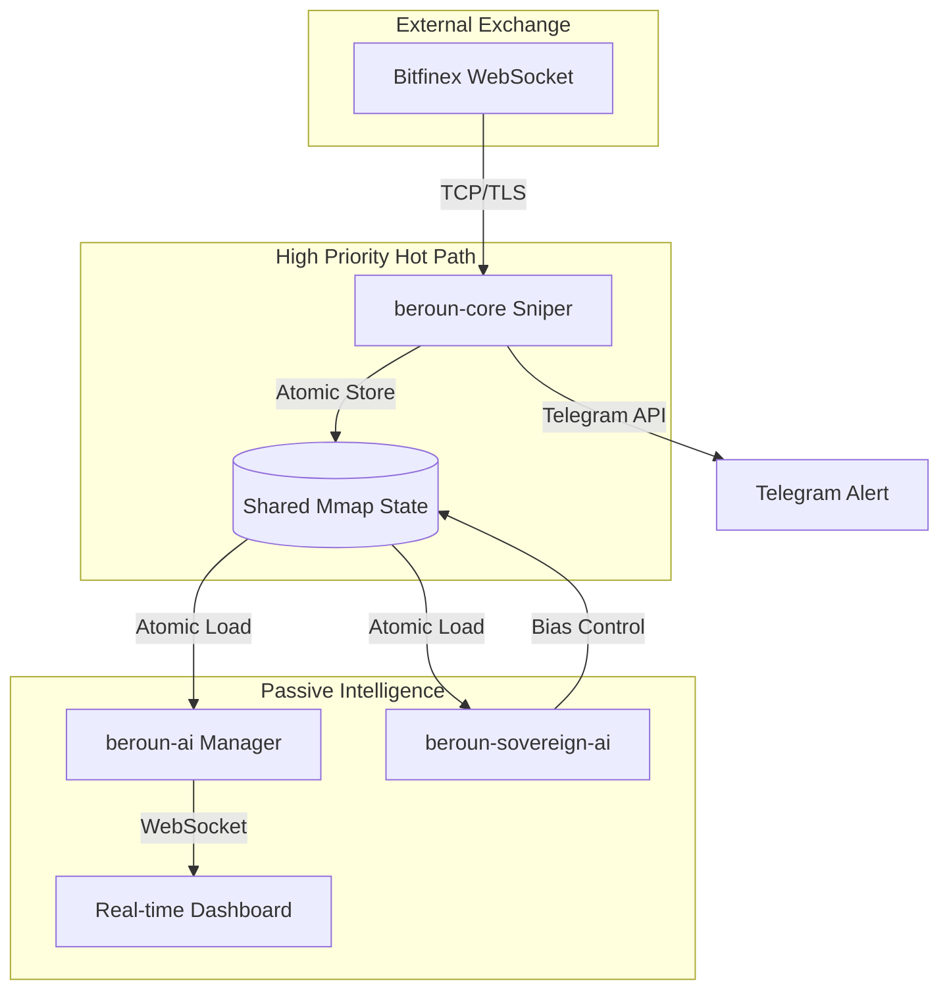

# 🐺 Beroun Sniper v5.0 (Sovereign HFT)

[](https://www.rust-lang.org/)
[]()
[]()

Ultra-nízko latenční obchodní engine pro Bitfinex, optimalizovaný pomocí **PGO (Profile-Guided Optimization)** a postavený na **Zero-copy mmap** architektuře pro rok 2026.

## 🏗 Architektura systému



## 🚀 Klíčové vlastnosti
- **Zero-copy parsing:** Minimální režie při zpracování tickerů.
- **Atomic Fixed-Point:** Eliminace jitterů FPU jednotky použitím celočíselné aritmetiky.
- **Sovereign Risk Management:** AI upravuje grid bias v reálném čase podle čisté pozice.
- **Watchdog Guardian:** Automatické sestřelení a restart při detekci stale dat v paměti.

## 🛠 Instalace a spuštění

### Požadavky
- Rust 1.80+ (Edition 2024)
- Linux (vázání na jádra CPU)

### Build a Optimalizace
Pro maximální výkon použijte přiložený PGO skript:
```bash
# Sběr dat a finální kompilace
bash optimize.sh
```

### Konfigurace
Zkopírujte `.env.example` do `.env` a vyplňte své API klíče.

## 📚 Dokumentace
- [Architektonické detaily](docs/ARCHITECTURE.md)
- [Obchodní strategie](docs/STRATEGY.md)
- [Pravidla pro AI agenty](GEMINI.md)

---
*Proprietární software pro autonomní obchodování.*
